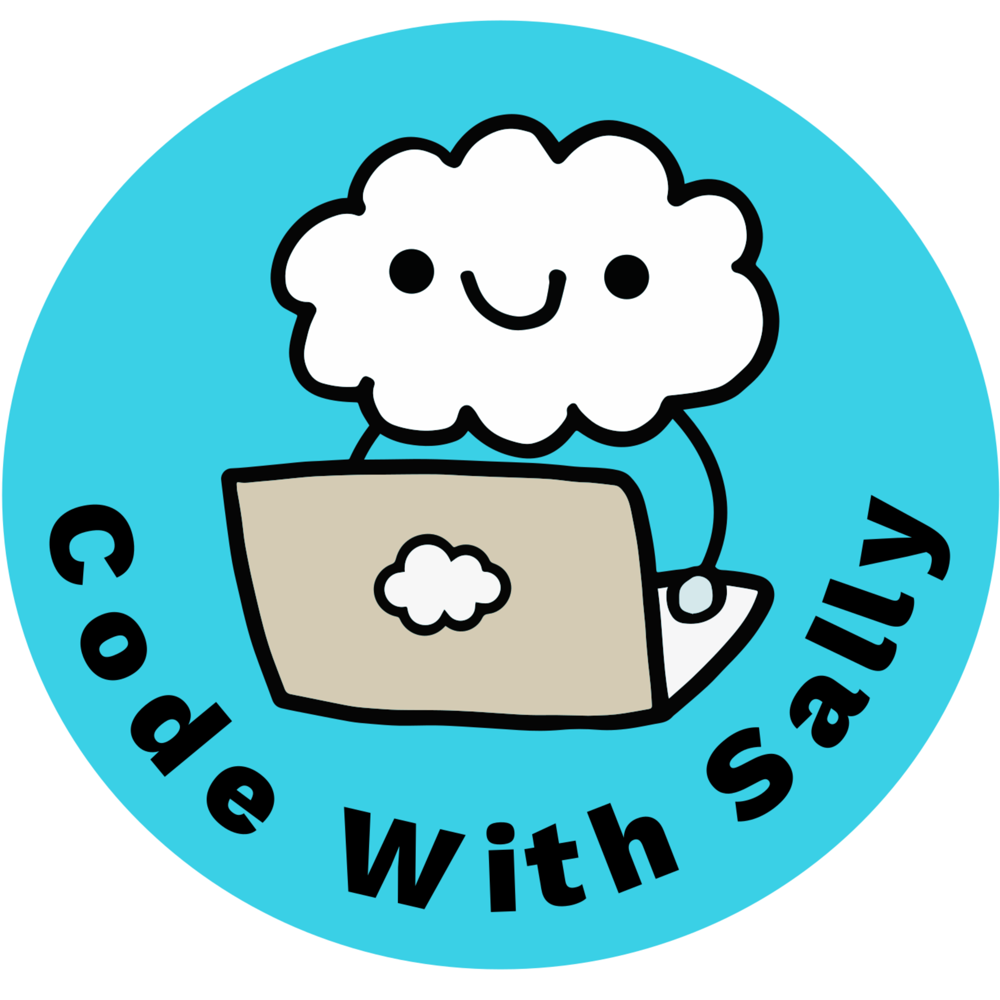
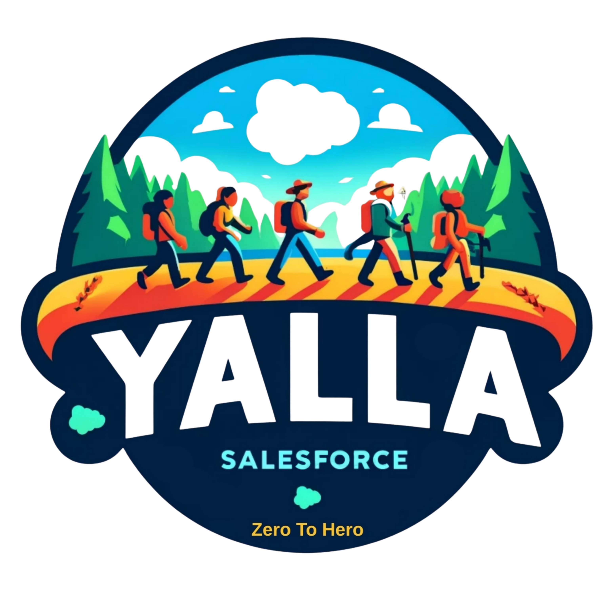

  
  &nbsp;&nbsp;&nbsp;&nbsp;
  

<h1 align="center" dir="ltr">From Dev To Architect: 8 Mindset Shifts You Can Start Today</h1>

  <strong>8 تحولات في طريقة التفكير تقدر تبدأها النهارده</strong> 
  السبت 26 سبتمبر 2026 
  السيشن بالعربي 
  تقديم <strong>سالي الغول</strong> و<strong>باسم إسماعيل</strong>

---

## 👋 أهلاً بيك

مش بتدوس على زرار فتبقى Architect. إنت **بتتمرّن عليها وإنت لسه بتكتب كود**.

الصفحة دي فيها كل حاجة من السيشن: الـ 8 تحولات، الحاجات اللي تقدر تبدأها النهارده، وأحسن المصادر عشان تكمّل. احفظها عندك: هنضيف هنا **الـ Slides (PDF)** و**تسجيل السيشن** بعد ما نخلّص.

> **قريب على الصفحة دي:** 📄 الـ Slides (PDF) · 🎥 تسجيل السيشن

---

## 🧭 الـ 8 تحولات، وكلها في إيدك

| # | التحول | الـ Architect | الـ Developer |
|---|---|---|---|
| 1 | لما تنضم للمشروع | بيشكّل الـ spec | بيبني منها |
| 2 | بتتعامل إزاي مع الطلب | بيسأل عن الطلب نفسه | بيوضّح الـ ticket |
| 3 | بتتواصل إزاي | بيتكلم business وtech حسب اللي قدامه | بيتكلم tech مع التيم |
| 4 | بترسم إيه | بيرسم الـ system كله | بيرسم الـ feature |
| 5 | بتختار الأدوات إزاي | بيختار من المنصة كلها وأبعد منها | بيختار جوه حدود الـ task |
| 6 | بتفكر لقدّام قد إيه | بيفكر بالسنين | بيفكر بالـ sprints |
| 7 | بتسلّم إيه | بياخد القرار ويكتبه | بيبني الحل ويعمل ship للكود |
| 8 | يومك شكله إيه | بيقرر ويتواصل طول اليوم | بيبني طول اليوم |

---

## ✅ مش محتاج title جديد عشان تبدأ. اختار واحدة النهارده!

- **اسأل عن الـ ticket قبل ما تبني.** متبنيش الطلب زي ما هو مكتوب. اسأل هو موجود ليه وناقصه إيه، قبل ما تكتب ولا سطر.
- **ارسم قبل ما تبني.** اعمل sketch للـ flow أو الـ data model بتاع الـ ticket قبل ما تبدأ.
- **اختار الأداة الصح، مش اللي متعود عليها.** الـ default بتاعك هو الكود. في الـ requirement الجاي، اسأل الأول الـ clicks ممكن تعمل إيه، وبعدين اختار الأنسب للشغل، مش الأريح ليك.
- **اكتب الـ why.** أخدت قرار واخترت approach بدل التاني؟ اكتب كام سطر: الـ context، الـ options، والـ why. الـ TAs بيسموها ADR، ودي هتبقى أول واحدة ليك.
- **ادخل الأوضة.** في أول design أو solution discussion جاي، اطلب تحضر وخلّي وجودك مفيد: اكتب الـ notes أو اعمل draft للـ decision record.
- **امسك design صغير.** اطلب تمسك الـ design بتاع feature واحدة من الأول للآخر، مش الـ build بس.

---

## 🎓 Code With Sally

**Code With Sally** منصة لتعليم Salesforce من سالي الغول: سيشنز تقنية لايف كل أسبوع عن Salesforce development والـ AI، **بالعربي والإنجليزي**، ومبنية على خبرة حقيقية من الـ production. عملية، صريحة، والـ mentorship أولاً.

- 🎥 **يوتيوب:** https://www.youtube.com/@CodeWithSally
- 📝 **الموقع والبلوج:** https://codewithsally.com/
- 💬 **مجتمع واتساب:** https://chat.whatsapp.com/EDfyHKY9eO53uzqqyMulhP?mode=gi_t
- 💼 **مجتمع Slack:** https://join.slack.com/t/codewithsally/shared_invite/zt-1u7djwtms-F~9c67~XDxI3B3a~KRJcoQ
- 🔗 **صفحة لينكدإن:** https://www.linkedin.com/company/codewithsally/
- 👤 **سالي الغول على لينكدإن:** https://www.linkedin.com/in/sallyelghoul/

**🚀 سيريز جديدة: From Dev to Architect** *(بالإنجليزي، وحلقات جديدة قريب!)*. Technical Architects ضيوف، كل واحد بيشرح concept أو أداة بيحبها:
👉 https://www.youtube.com/playlist?list=PLPNtu86_ZZn0

**🤝 انضم لجروب الـ Trailblazer Community بتاعنا:**
👉 https://trailhead.salesforce.com/trailblazer-community/groups/0F9KX000000irsF0AQ

---

## 🏔️ Yalla Salesforce

**Yalla Salesforce** (*Zero to Hero*) هو المجتمع اللي أسسه باسم إسماعيل سنة 2024 عشان يرد الجميل للكوميونيتي، ونتعلم ونشارك ونكبر كلنا مع بعض. محتوى بسيط وعملي بيساعد اللي شغالين في Salesforce يطوّروا الكارير بتاعهم ويفكروا بعقلية الـ Architect.

- 🎥 **يوتيوب:** https://www.youtube.com/@YallaSalesforce
- 🔗 **صفحة لينكدإن:** https://www.linkedin.com/company/yalla-salesforce/posts/?feedView=all
- 👤 **باسم إسماعيل على لينكدإن:** https://www.linkedin.com/in/bassem-ismaiel/

### رحلة باسم في سطور

**+19 سنة** في التكنولوجيا · **12 سنة** في Salesforce · **3 دول** · **27** شهادة Salesforce · **50** Superbadge

| السنة | المحطة |
|---|---|
| 2007 | بدأ في الـ Business Intelligence في مصر |
| 2011 | Data Warehouse Architect في CIB |
| 2014 | سافر لندن ودخل عالم Salesforce |
| 2016 | نقل كندا كـ Salesforce Data Architect |
| 2018 | أول شهادة Salesforce: Platform Administrator |
| 2022 | انضم لـ Salesforce كـ Technical Architect وأخد Application Architect |
| 2024 | أسس Yalla Salesforce، وأخد B2B Solution Architect وAll Star Ranger |
| 2025 | System Architect وAgentblazer Legend، وبقى Lead Salesforce Architect في Electric Mind |

---

## 📚 مصادر Salesforce الرسمية للـ Architects

أحسن أماكن تكمّل فيها تتعلم إزاي *تفكر زي الـ Architect*، من Salesforce نفسها:

- **Architecture Center:** المكان الرئيسي لكل حاجة: Well-Architected، الـ diagrams، الـ decision guides، والأساسيات.
  👉 https://architect.salesforce.com/
- **Think Like an Architect:** سيريز لايف ستريم وبلوج بتعلّمك طريقة *What / How / Why*.
  👉 https://www.salesforce.com/blog/think-like-an-architect/
- **Well-Architected Framework:** الـ standard للحلول اللي تبقى Trusted وEasy وAdaptable (أداة ممتازة تراجع بيها قراراتك).
  👉 https://architect.salesforce.com/well-architected
- **Salesforce Diagramming Framework:** إزاي ترسم architecture diagrams واضحة (بـ Lucidchart ومكتبة الـ shapes بتاعة Salesforce).
  👉 https://architect.salesforce.com/diagrams
- **Decision Guides:** إرشادات للـ trade-offs في قرارات الـ architecture المشهورة (integration، data، async، وغيرهم).
  👉 https://architect.salesforce.com/decision-guides/
- **Salesforce Architects (YouTube):** فيديوهات قصيرة وشرح متعمق من الـ Architecture Program.
  👉 https://www.youtube.com/@SalesforceArchitects

---

  <em>بطّل تسأل "ينفع نبنيها؟" وابدأ اسأل "المفروض نبنيها؟ وهتستحمل؟"</em>

  اتعمل بـ 💙 من <strong>Code With Sally</strong> و<strong>Yalla Salesforce</strong>

